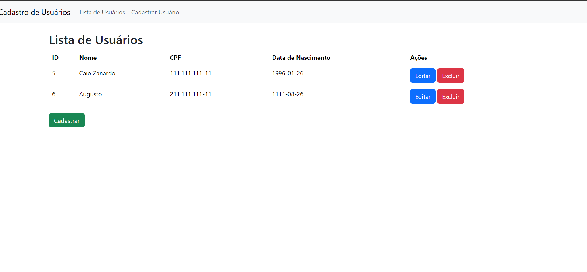
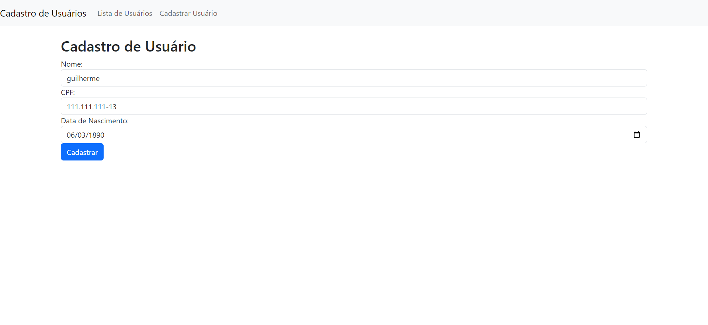
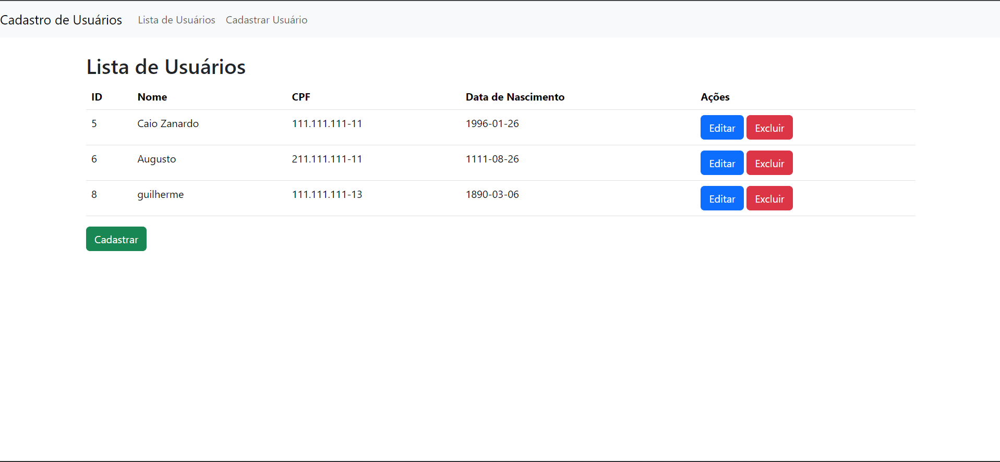

# Conteúdo criado Para o CheckPoint DIGITAL EXPERIENCE PLATAFORM(BackEnd)

## Instalar programa local

- 1º Passo: Fazer o start no "Xampp" do Apache e Mysql
- 2º Passo: Baixar arquivos do repositório na pasta htdocs;
- 3º Passo: Acessar a pasta via terminal e rodar "php artisan migrate" para criar o Banco de Dados;

## Modo de uso

- Clicar no botão "Cadastrar";

- Preencher informações e clicar no botão "Cadastrar";

- Para Editar ou Excluir um cadastro só utilizar os botões no canto direito da tela;

  
## Grupo do CheckPoint

- André Spinelli Cintra RM 551016
- Augusto de Oliveira Laurino RM 93498
- Caio Felipe Britto Zanardo da Silva RM 95125
- Gabriel Wilke Azevedo RM 95211
- Guilherme de Lucas Garcia RM 94392
